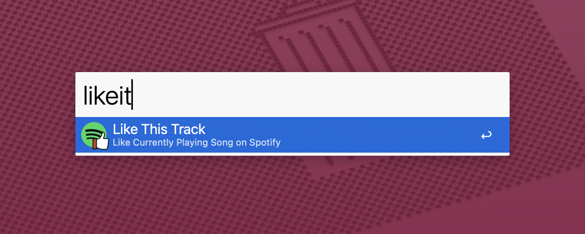

## Setup

Create a Spotify app:

1. Go to [Spotify Developer Dashboard](https://developer.spotify.com/dashboard)
2. Click "Create an App"
3. Copy your `Client ID` and `Client Secret`
4. Add `http://localhost:8888/callback` as a redirect URI

Configure the Workflow's Configuration with your Spotify credentials.

## Usage

Toggle the like status of the currently playing Spotify track via the `likeit` keyword.

* <kbd>↩</kbd> Toggle like status of current track.

